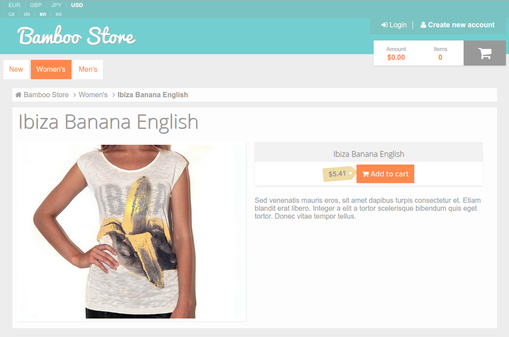
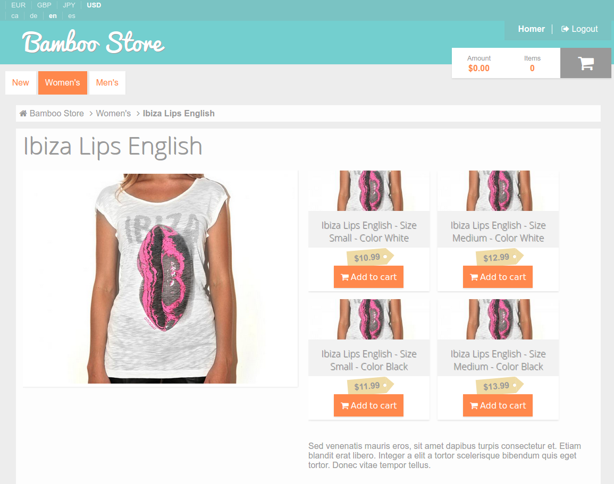
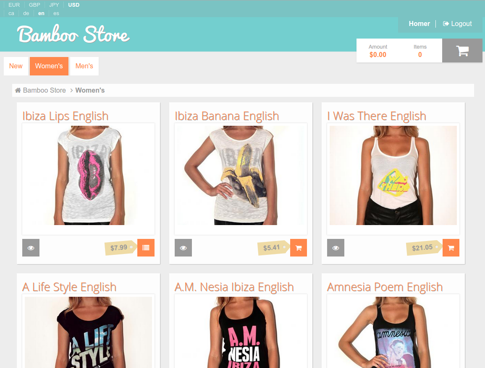
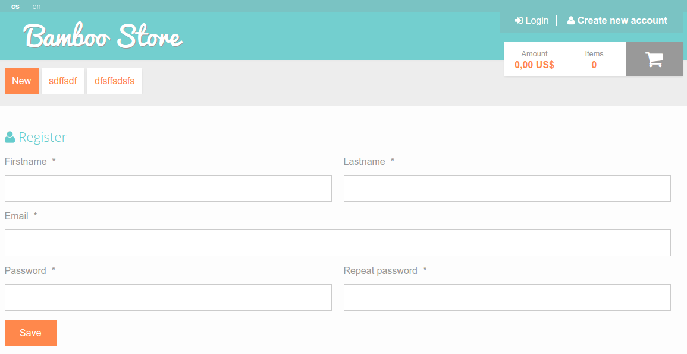

# Processes

In this chapter you will find a set of Bamboo processes. A process is just a
page loaded or a specific action from an already loaded page.

Each entry of this chapter has the same predefined format, taking in account
that all links work having a clean Bamboo installation listening to
http://localhost:8000

**Given** - Initial environment and requirements  
**When** - Our elemental action  
**Then** - Actions ocurred because of that previous actions. Sent emails and 
important dispatched events are described here as well.

In each scenario, we'll provide as well some nice sections for you to know a
little bit more about it.

* Events dispatched - Events dispatched by the symfony component or any Elcodi
components
* Email sent - Emails sent by the application during this action
* Related links - Interesting links to know a little bit more about the scenario
* Nice improvements - Small tips about how to improve the scenario.

## Load any page

All pages have a common set of elements described as follows. All elements
belong to the application, so they are applicable to all web requests.

**Given** - As a user, no matter the credentials  
**When** - We want to visit any application page  
**Then** - These actions happen  

* Request is handled by the Bamboo application, on top of the Symfony Framework,
Symfony components and Elcodi components.
* The user is loaded by using the session information
* The user credentials are checked and analyzed in order to find authentication
and authorization information.
* If the user can visit the page, then the response is created and served to the
user.
* Otherwise, you'll receive a redirection to login page
* Some user related information is loaded from database
* Some language related information is loaded from database, taking in account
the user or using stored-in-session data
* Some currency information is loaded the same way than language
* The request is processed

Related links

* [HTTP Fundamentals](http://symfony.com/doc/current/book/http_fundamentals.html)
* [Symfony Security](http://symfony.com/doc/current/book/security.html)
* [Session Management](http://symfony.com/doc/current/components/http_foundation/sessions.html)

## Load the home page

The main page, or home page, is always treated as a simple category page, having
that the way of retrieving the products is by filtering by the field `inHome`.

**Given** - As a user, no matter the credentials  
**When** - We visit the home page, http://localhost:8000  
**Then** - We can see the N first products  

## Load the product page

The product page is one of the most important landing pages in the whole
e-commerce project. You will find all product related information and all the
needed buttons for adding the product in your Cart.

**Given** - As a user, no matter the credentials  
**When** - We visit a product without variants page
**Then** - All the product information is reached from the database and shown in
a single page. Because the product has no variants, you can add this product in
your cart by pushing the *add to cart* button.

Related links

- [Product Architecture](http://elcodi.io/docs/book/product-architecture/)

Improvements

- As soon as your website has any search service (Like elasticsearch or Solr),
all product-related data should be required from there instead of using
database. To do that, you should save all needed information in the search
server in order to avoid sql connection

## Load the variants page

In this case, the product we're loading has variants, so the product itself is
only the master of different product variations (see related links). The meaning
of this page is the same than the product one, but in this case, we will load as
well all the variants information.

Of course, each variant

**Given** - As a user, no matter the credentials  
**When** - We visit a product with variants page
**Then** - All the product information is reached from the database and shown in
a single page. Each variant will provide you the information about adding it
into cart, considering each variant as a product with some defined values.

Related links

- [Product Architecture](http://elcodi.io/docs/book/product-architecture/)

## Load the category page

Just a search page, filtering by categories

**Given** - As a user, no matter the credentials  
**When** - We want to see all products from a category, http://localhost:8000/category/women-shirts/1  
**Then** - This page has the same behavior than the home page, but filtering by
category.

Related links

- [Product Architecture](http://elcodi.io/docs/book/product-architecture/)

## Register

Register a new user in the application.

**Given** - As a not logged non registered user  
**When** - We want to register, http://localhost:8000/register  
**Then** - once added our basic and needed information, and pressed the 
*register* button, a new user is added into the database. Is important to know
that our stored password is never saved plain and decrypted. We use BCrypt for
that reason.

Events dispatched

* [user.register](http://elcodi.io/docs/book/events/#userregister)
* [customer.register](http://elcodi.io/docs/book/events/#customerregister)

Sent emails

* [Customer registered]()

Related links

* [Bcrypt in Wikipedia](https://en.wikipedia.org/wiki/Bcrypt)
* [Security Bundle Configuration](http://symfony.com/doc/current/reference/configuration/security.html)

## Login

Login in the application

**Given** - As a not logged non registered user  
**When** - We want to log in, http://localhost:8000/login  
**Then** - once added our basic and needed information, and pressed the 
*login* button, the system checks that given user exists in database and that
given password and stored one is the same. If they are, then the user is
authenticated in current session and allowed to access into the private zone.
Otherwise, the user is redirected to the same page with relevant errors.

Related links

* [Bcrypt in Wikipedia](https://en.wikipedia.org/wiki/Bcrypt)
* [Security Bundle Configuration](http://symfony.com/doc/current/reference/configuration/security.html)

## Logout

Logout from the application

**Given** - As a logged user
**When** - We want to log out from the website, http://localhost:8000/logout
**Then** - Once we decide to logout, we only need to remove the session
credentials and the Symfony Security Component will do the rest.

Related links

* [Security Bundle Configuration](http://symfony.com/doc/current/reference/configuration/security.html)
